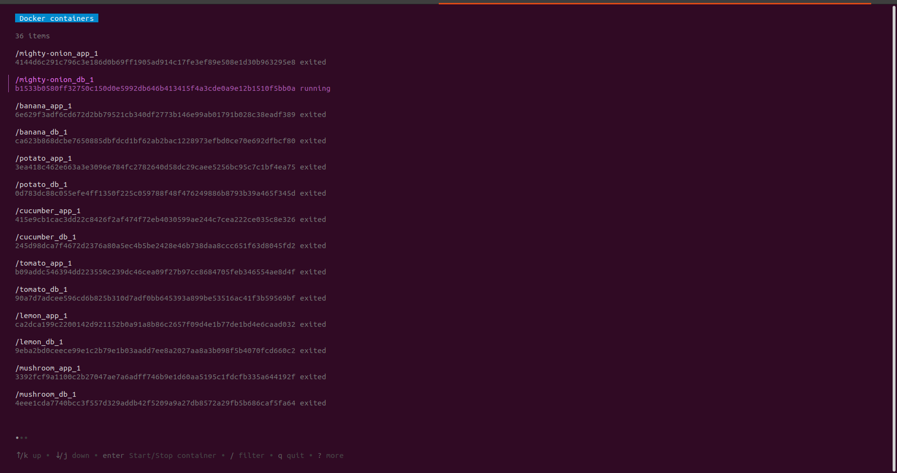

# docker-tui
Simple docker tui that lets you list, start and stop your containers.

## Current status
Rough, initial prototype.
## Build with
This tool relies on amazing [bubbletea](https://github.com/charmbracelet/bubbletea) and [bubbles](https://github.com/charmbracelet/bubbles) from [https://charm.sh/](https://charm.sh/) as well as on [Docker client package](https://pkg.go.dev/github.com/docker/docker/client).

## Works on my machine...
Tested on Ubuntu 20.04, `go version go1.17.2 linux/amd64`

## How to use
Assuming your docker deamon is running, app presents list of all docker containers by default. You can see status of each container at the end of description line of each item (says "exited" or "running"). Use arrow keys to navigate the list. Press `enter` key on selected item to try to change it's status (start exited container or stop running one). Press `c` key to toggle between list of all containers and list of running containers only (corresponds to `docker ps -a` and `docker ps` commands). You can filter list by matching container names - press `/` to open filter input. Filter works in combination with all/running option, so you can see filtered results for all or running containers - up to you.

Press `q` key or `ctrl+c` to quit.

## Known issues
- After quitting app with `q` or `ctrl+c`, you need to press `ctrl+c` again to get back to command line prompt.
- While starting/stopping container, UI is frozen.
